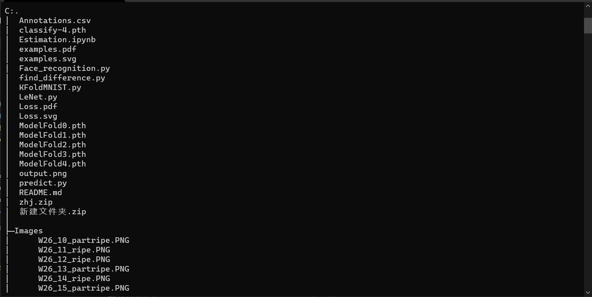
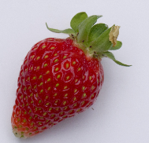

# Pattern-Recognition-Project
Project for 2021 Fall Pattern Recognition, SEU. Full report and source code will be released after Jan 2, 2022.

In this project, we adopted Convolutional Neural Network (CNN) to a smart farm image analysis system, which can classify a strawberry as ripe, part-ripe, or unripe, or estimate its acidity and Brix (a value used to quantify its taste) based on its image.

Due to copyright restrictions, we cannot release the dataset.

The dataset, which includes a `.csv` file and a folder of images called `Images` is organized like this: 

In `Annotations.csv`, the filenames of images, as well as the brix and acid of the strawberries are listed like this.

>file_name,label,avg_Brix,avg_Acid\
W26_1_ripe.PNG ,ripe,8,1.45\
W26_2_ripe.PNG  ,ripe,10,0.97

In `Images` folder, there are totally 502 images of strawberries, and here is an example.

In the end, thank ZZN for his work in the classification task.
